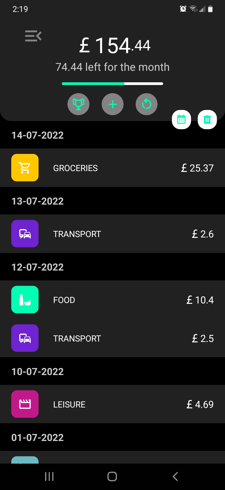
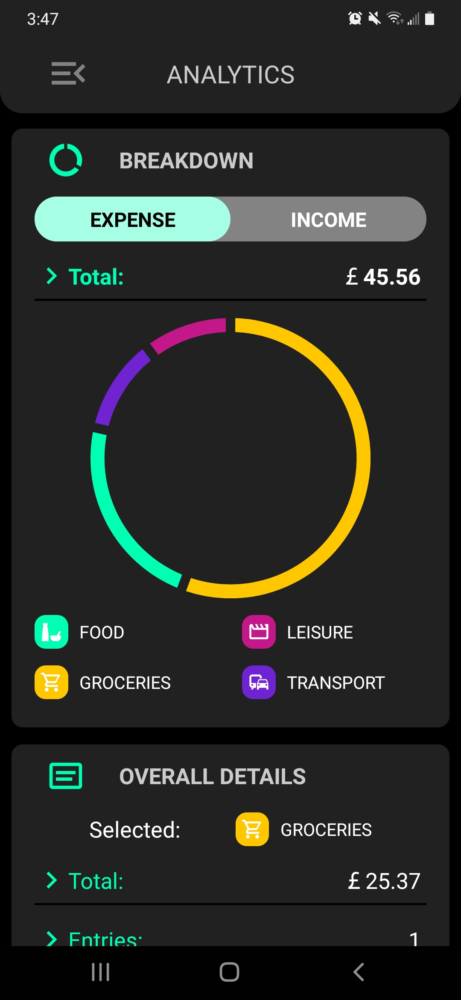
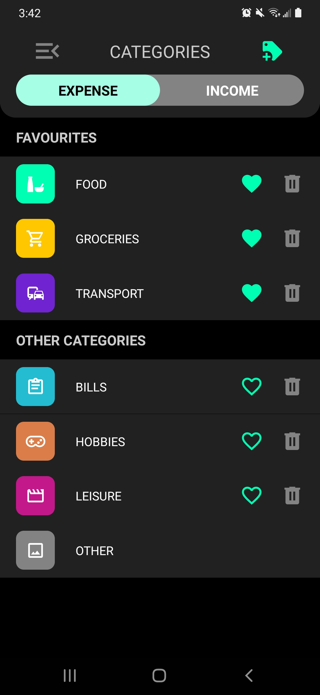
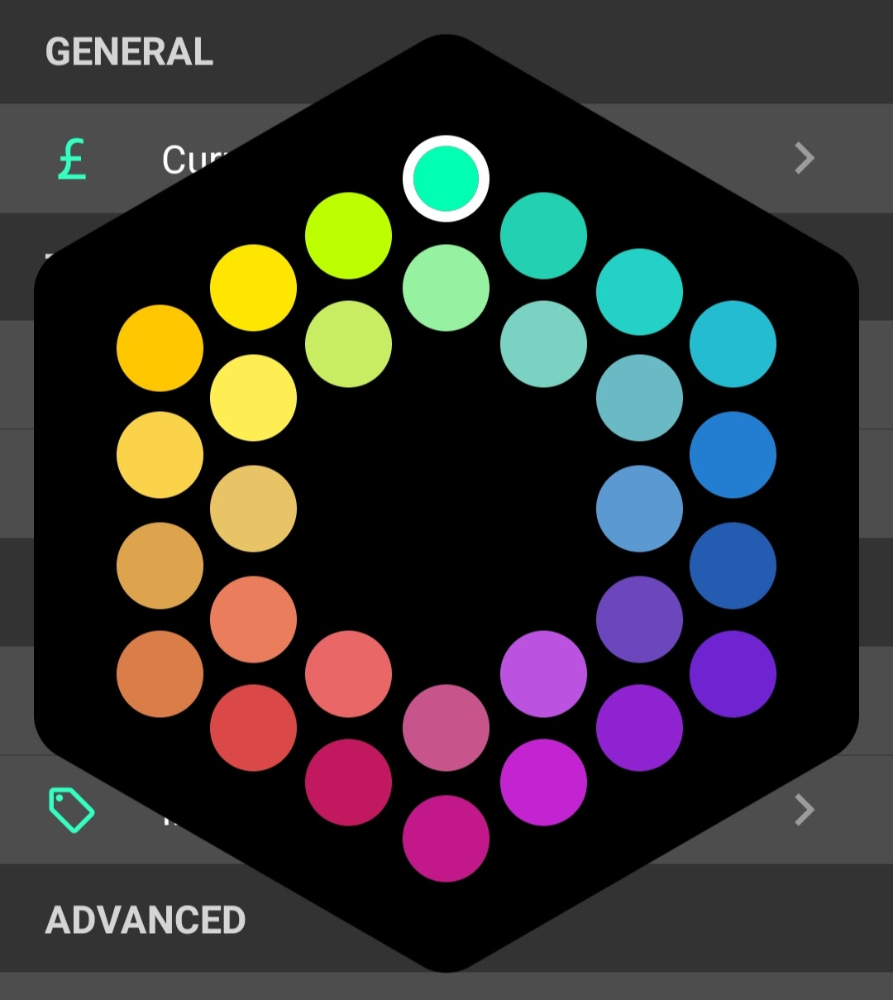
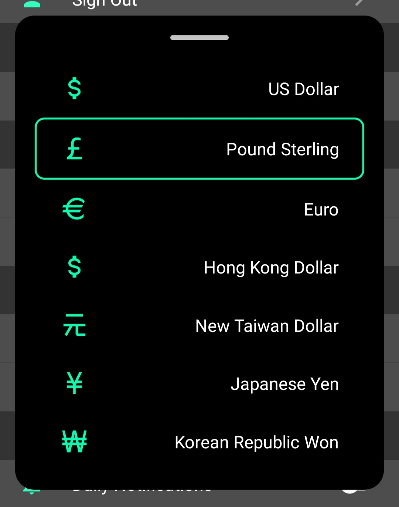

## Records

<table>
    <tr>
        <td valign='top' width='210' height='351'>
            
        </td>
        <td valign='top'>
            Records are classified by category, which can have custom icons, colour, and names. Custom categories can be added by users, existing categories can also be customised to the user's liking.
        </td>
    </tr>
</table>

## Analytics

<table>
    <tr>
        <td valign='top' width='210' height='351'>
            
        </td>
        <td valign='top'>
             Analytics provided include a proportion pie chart of both spendings and income entries, categories sums, total sums, spending goal progress tracking, and most frequent or most expensive categories.
        </td>
    </tr>
</table>

## Customisation

### Categories

<table>
    <tr>
        <td valign='top' width='210' height='351'>
            
        </td>
        <td valign='top'>
            Users can select from <b>various icons</b> to create their own custom categories to label their spendings and incomes. Each category is stylable with the 30 custom colours provided by the colour picker.
        </td>
    </tr>
</table>

### Colors

<table>
    <tr>
        <td valign='top' width='210'>
            
        </td>
        <td valign='top'>
            With a custom colour picker, users can choose from <b>30 different flat design colours</b> and customise their app's accent. Light mode is also a togglable option in the settings.
        </td>
    </tr>
</table>

### Currency Labels

<table>
    <tr>
        <td valign='top' width='210'>
            
        </td>
        <td valign='top'>
            Users can select their currency label for their spending records, which include: <b>USD, GBP, EUR, HKD, NTD, JPY, KRW</b>.
        </td>
    </tr>
</table>

## Notifications

Notifications can be set to remind users to record and update their expenses **daily**. While the notification's default firing time is at 11:00PM local time, they can be customised to **fit the user's personal schedule**.

## Account System

Accounts can be set up in the app, which can be used to store data on the cloud store. Though the app itself can be used without an account. Account authentication is managed by **Firebase Authentication**.

### Data Management

Data is stored both locally and on the cloud via Firebase's **Realtime Database System**. Data syncing can be done with a press of a button. Syncing methods include

-   **Select latest (default)**
-   **Cloud overwrite**
-   **Local overwrite**
